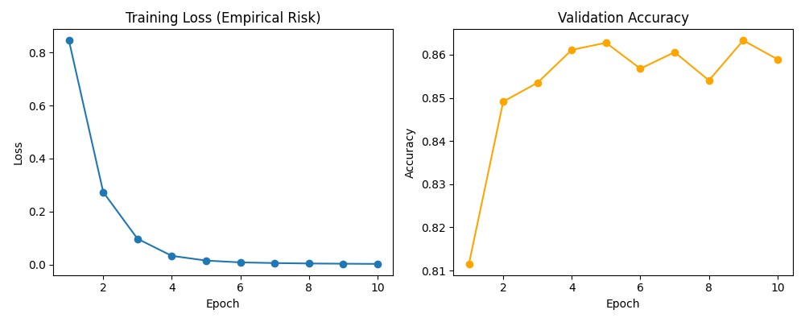

# SoCalGuessr — City Classification from Street View Images

> Fine-tuned ResNet18 · **86.3% validation accuracy** · PyTorch · Transfer Learning

A deep learning classifier that predicts which Southern California city a Google Street View image was taken in — outperforming the human baseline of 28% by a factor of 3x.

---

## The Task

Given a street-level image from one of 6 Southern California cities, predict the city:

`Anaheim` · `Bakersfield` · `Los Angeles` · `Riverside` · `SLO` · `San Diego`

This is harder than it sounds — many SoCal cities share similar roads, vegetation, and sky. Even humans only manage ~28% accuracy without local geographic knowledge.

---

## Results

| | Accuracy |
|---|---|
| 🤖 This model | **86.3%** |
| 👤 Human baseline | 28% |



---

## Approach

**Transfer Learning with ResNet18**
- Loaded ResNet18 pretrained on ImageNet (11M parameters)
- Replaced the final fully connected layer: `512 → 6 cities`
- Froze layers 1–3 (edge/texture/shape detectors — already good from ImageNet)
- Fine-tuned only layer4 + fc on the SoCalGuessr training data (~2.7M trainable parameters)

**Why this works:** Early ResNet layers already know how to detect edges, textures, and shapes from ImageNet training. We only needed to teach the model the SoCal-specific patterns — what combinations of features distinguish a San Diego street from a Riverside street.

**Training details:**
- Optimizer: Adam (lr = 1e-4)
- Loss: Cross-entropy
- Batch size: 128
- Image size: 128×128
- Early stopping: patience = 5 epochs
- Hardware: Apple Silicon MPS GPU
- Training time: under 5 minutes

---

## Deployment Constraints

This project was built under real-world production constraints:
- ✅ Model size < 50MB
- ✅ Inference time < 10 minutes
- ✅ RAM usage < 6GB

---

## Files

| File | Description |
|---|---|
| `train.py` | Training script — fine-tunes ResNet18 on the SoCalGuessr dataset |
| `predict.py` | Inference script — loads saved weights and predicts city for each test image |
| `training_curve.png` | Training loss and validation accuracy across epochs |

---

## How to Run

```bash
# Install dependencies
pip install torch torchvision pillow matplotlib

# Train the model (requires dataset in ./data/)
python train.py

# Run inference on a directory of test images
python predict.py
```

---

## Built With

Python · PyTorch · torchvision · Matplotlib · PIL

---

*DSC 140B Final Project — UC San Diego*
